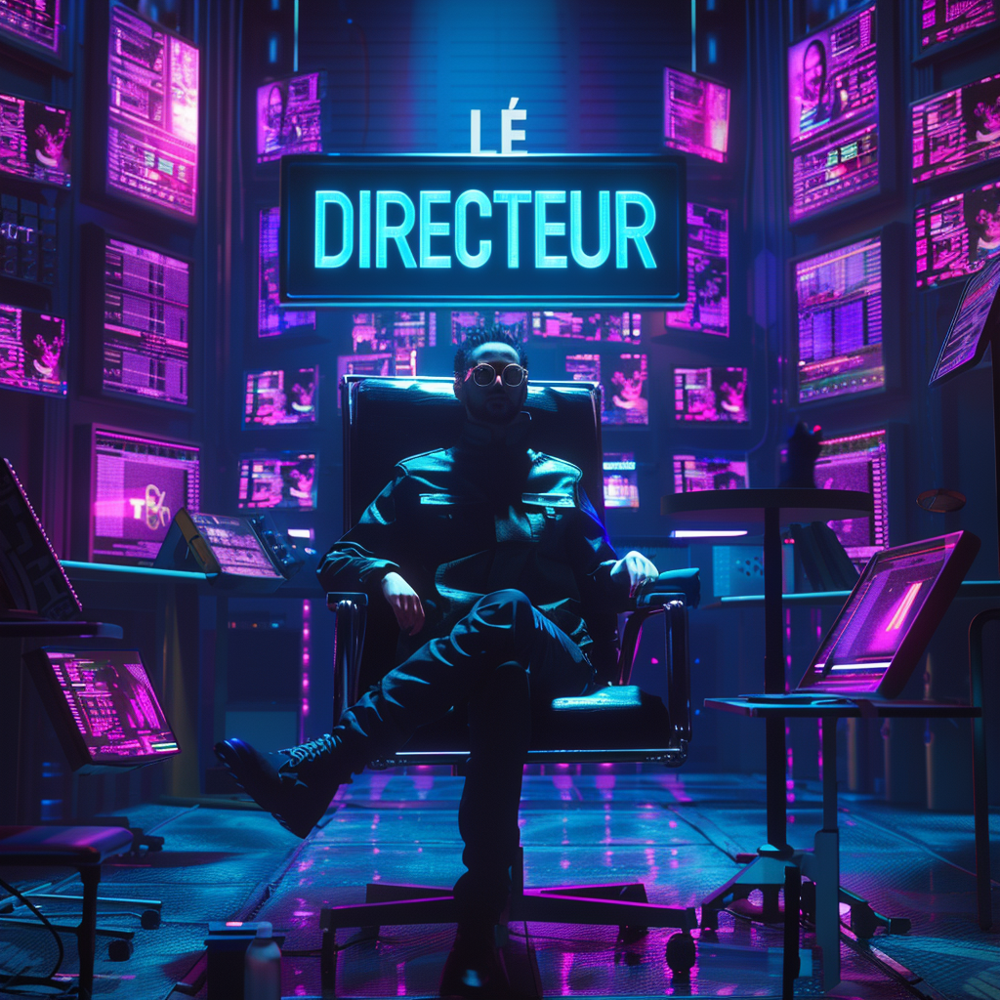

# 🎬 ClipMaître

<table>
  <tr>
    <td>

**Project Type:** AI-Powered Video Clipping + Short-Form Content Generator    
**Agent Role:** A pompous French director AI who slices long-form content into award-worthy Reels, Shorts, and TikToks — with creative flair and narrative obsession.

</td>
<td align="right" width="250">
  
</td>
  </tr>
</table>

---

## 🔍 Purpose
Long-form content is often underutilized — packed with value, but rarely repurposed well. ClipMaître exists to *elevate* short-form output with stronger storytelling, smarter clip choices, and personality-infused titles, captions, and thumbnails.

Think: Less "random auto-clip," more "director’s cut."

---

## 🎯 Problem → Solution

> **Problem:** Long-form content wasn’t being effectively leveraged into short-form clips that matched the brand tone and storytelling style.
>
> **Solution:** Designed an AI system that ingests full episodes, identifies story-driven highlights, and drafts platform-specific titles, captions, and hooks — ready for reels or TikToks.

---

## ✨ Features

- 🎯 **Highlight Detection** — Uses AI to identify emotionally engaging or informative segments
- ✍️ **Auto Captions & Hooks** — Generates short-form captions and intros styled for Instagram/TikTok
- 🧠 **Title Suggestions** — Drafts 3–5 clip titles that lean into narrative, tone, or virality
- 🎨 **Thumbnail Prompting** — Suggests frame, face, and text direction for reels
- 🧾 **Content Pack Export** — Outputs structured Markdown or JSON ready for QA and upload

---

## ♻️ Workflow

1. **Upload Transcript** (YouTube or Frame.io)
2. **Run through Prompt Logic** (GPT-4, NotebookLM assist)
3. **Extract 3–6 Highlights** (Based on emotion, energy, clarity)
4. **Generate Outputs per Highlight:**
   - Title
   - Caption
   - Thumbnail Prompt
   - Optional CTA
5. **Review + Schedule** in Google Sheets, Notion, or Meta

---

## 🔧 Stack

- **GPT-4 / GPT-4o** — core prompt logic
- **NotebookLM** — deep research on context
- **Google Sheets** — content handoff, QA
- **Notion** — reference library and feedback
- **n8n** — automation layer for workflows

---

## 📦 Status
- ✅ In live use for weekly podcast repurposing
- 🔄 Refining prompt logic for emotional arc detection
- 🛠️ Building n8n ingestion-to-output pipeline

---

## 👥 Cast & Crew

### **🎬 ClipMaître** – The Director  
> "This is not content. This is *cinéma*."

### **🎤 Phillip Short** – The Spokesman  
> "Our reels have *narrative arc*, *emotional payoff*, and *hook cadence*."

---

## 📘 Creator Notes

This agent was designed as a portfolio-grade project and workflow enabler:

- **Real use case:** Live content from two clients
- **Human-in-the-loop:** All clips reviewed
- **Future roadmap:** More automation, fewer mid-tier tools

---

## 🧠 Part of the Vibe Agent Series

Creative agents for real-life bottlenecks.

[⬅ Back to Agent Index](https://github.com/RosTalbot/vibe-agent-series)
